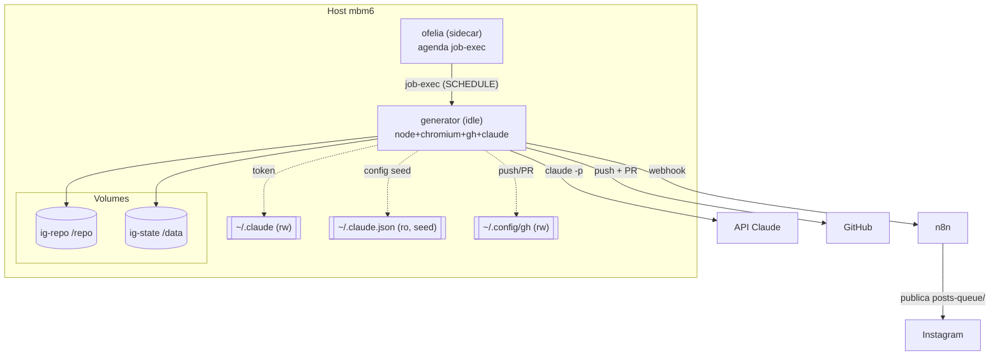
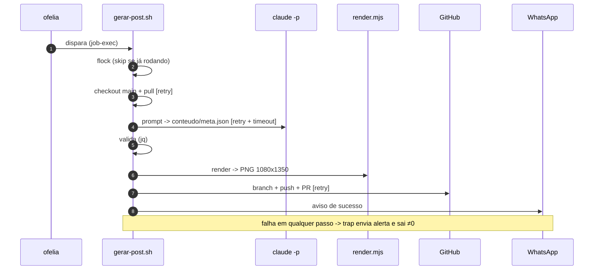

# Arquitetura — Gerador de Posts v2 (Docker)

Stack local (mbm6) em `~/docker/instagram-post-generator/`. Substitui o scheduler
em bash no cron do host. Detalhe completo na spec
`docs/superpowers/specs/2026-06-19-instagram-post-generator-v2-docker-design.md`.

## Componentes

## Fluxo de um post

