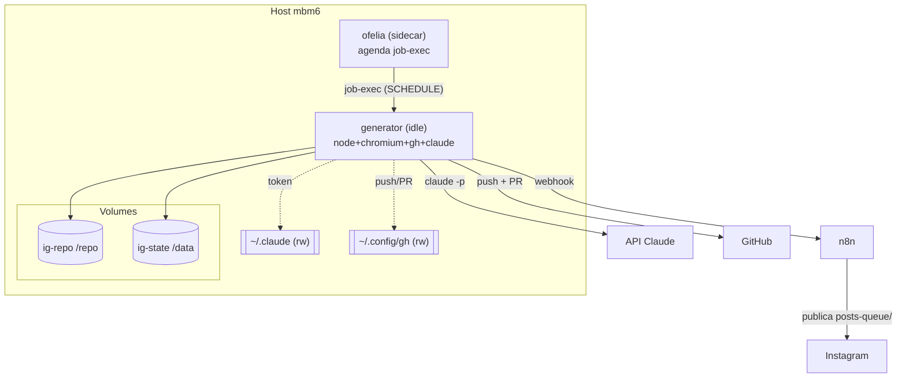
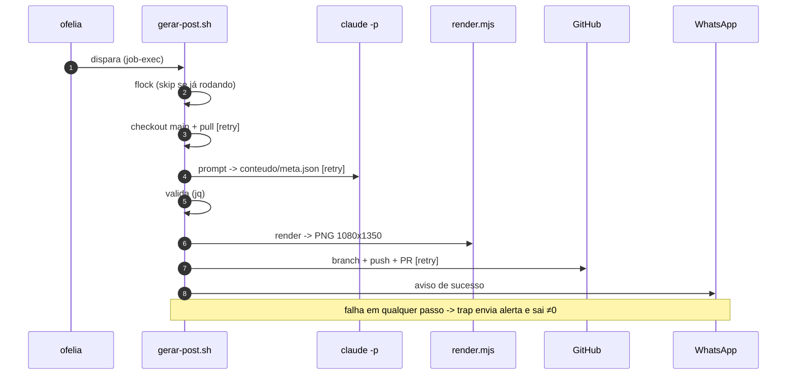

# Gerador de Posts do Instagram v2 (Docker) — Implementation Plan

> **For agentic workers:** REQUIRED SUB-SKILL: Use superpowers:subagent-driven-development (recommended) or superpowers:executing-plans to implement this plan task-by-task. Steps use checkbox (`- [ ]`) syntax for tracking.

**Goal:** Containerizar o gerador de posts do Instagram numa stack autocontida (Docker-first), preservando o pipeline do v1 e adicionando retry/backoff, alerta de falha no WhatsApp, lock anti-duplicata e estado persistente em volume.

**Architecture:** Dois containers numa stack em `~/docker/instagram-post-generator/`: `generator` (imagem deste repo, com todo o toolchain — node, Chromium, gh, jq, ImageMagick, `claude` CLI — rodando idle) e `ofelia` (sidecar que dispara `gerar-post.sh` via `job-exec` no schedule). O repo é um clone próprio em volume nomeado; histórico e logs vivem em outro volume. Auth do Claude e do `gh` entram por bind-mount rw.

**Tech Stack:** Docker + Docker Compose, `mcuadros/ofelia`, base `node:20-bookworm-slim`, Bash, Chromium headless, GitHub CLI, jq, ImageMagick.

**Spec:** `docs/superpowers/specs/2026-06-19-instagram-post-generator-v2-docker-design.md`

---

## File Structure

**Neste repo (`instagram-posts`):**
- `Dockerfile` — imagem do `generator`.
- `.dockerignore` — enxuga o contexto de build.
- `scheduler/lib.sh` — funções puras (migrado de `.scheduler/lib.sh`) + `retry()`.
- `scheduler/gerar-post.sh` — pipeline (migrado, com paths via env, lock, trap de falha, retry).
- `scheduler/entrypoint.sh` — bootstrap do `/repo` (clone/init+seed), identidade git, `gh` credential helper, rotação de log; depois `exec "$@"`.
- `scheduler/prompt-criar-post.md` — prompt (cópia 1:1 de `.scheduler/prompt-criar-post.md`).
- `scheduler/tests/test_lib.sh` — testes das funções puras + `retry()`.
- `scheduler/tests/test_entrypoint.sh` — testes de `bootstrap_state`.
- `renderer/render.mjs`, `renderer/template.html`, `renderer/fonts/*` — renderizador vendorizado.
- `docs/ARQUITETURA.md` — diagramas Mermaid (arquitetura + fluxo).

**Em `~/docker/instagram-post-generator/`:**
- `docker-compose.yml`, `.env`, `README.md`.

**Removidos no cutover:** linha do `crontab` do host; `.scheduler/` fica deprecado.

---

## Task 1: Vendorizar o renderizador

**Files:**
- Create: `renderer/render.mjs`, `renderer/template.html`, `renderer/fonts/fonts.css`, `renderer/fonts/f00.woff2` … `renderer/fonts/f12.woff2`

- [ ] **Step 1: Copiar a skill para `renderer/`**

```bash
SK="$HOME/.claude/skills/marcelomatos-instagram-post"
mkdir -p renderer/fonts
cp "$SK/render.mjs" renderer/render.mjs
cp "$SK/template.html" renderer/template.html
cp "$SK/fonts/fonts.css" renderer/fonts/fonts.css
cp "$SK"/fonts/f*.woff2 renderer/fonts/
```

- [ ] **Step 2: Verificar que `render.mjs` resolve assets do próprio diretório**

Run: `grep -n "__dir" renderer/render.mjs`
Expected: usa `join(__dir, 'template.html')` e `join(__dir, 'fonts')` — nenhuma edição necessária (assets são relativos ao arquivo).

- [ ] **Step 3: Render smoke-test no host (host tem chromium+convert)**

```bash
cat > /tmp/cont.json <<'JSON'
[{"num":1,"eyebrow":"TESTE","title":"Render vendorizado funciona","body":"Smoke test.","cta":"WhatsApp na bio →"}]
JSON
node renderer/render.mjs /tmp/cont.json /tmp/render-out
```
Expected: imprime `✓ /tmp/render-out/post-01.png` e `1 post(s)`.

- [ ] **Step 4: Conferir dimensões do PNG**

Run: `identify -format '%wx%h\n' /tmp/render-out/post-01.png`
Expected: `1080x1350`

- [ ] **Step 5: Commit**

```bash
git add renderer/
git commit -m "feat: vendoriza renderizador de arte (render.mjs + template + fontes)"
```

---

## Task 2: Funções puras + `retry()` (`scheduler/lib.sh`) — TDD

**Files:**
- Create: `scheduler/lib.sh`
- Test: `scheduler/tests/test_lib.sh`

- [ ] **Step 1: Escrever o teste falhando**

Create `scheduler/tests/test_lib.sh`:

```bash
#!/usr/bin/env bash
set -uo pipefail
HERE="$(cd "$(dirname "${BASH_SOURCE[0]}")" && pwd)"
# shellcheck source=/dev/null
source "$HERE/../lib.sh"

fails=0
check() { # check <descrição> <esperado> <obtido>
  if [ "$2" = "$3" ]; then echo "ok: $1"; else echo "FALHOU: $1 (esperado '$2', obtido '$3')"; fails=$((fails+1)); fi
}

# pilares por dia (date +%u: 1=seg..7=dom)
check "pilar seg" "dor" "$(pilar_do_dia 1)"
check "pilar ter" "antes-depois" "$(pilar_do_dia 2)"
check "pilar qua" "educacao" "$(pilar_do_dia 3)"
check "pilar qui" "prova" "$(pilar_do_dia 4)"
check "pilar sex" "dor" "$(pilar_do_dia 5)"
check "pilar dom (fallback)" "dor" "$(pilar_do_dia 7)"

# slugify (ascii — evita variação de locale no //TRANSLIT)
check "slugify simples" "mitos-automacao-pme" "$(slugify 'Mitos Automacao PME')"
check "slugify pontuação" "tres-coisas" "$(slugify 'Tres   Coisas!!!')"

# retry: falha 1x e sucede na 2ª (sem espera)
attempts=0
flaky() { attempts=$((attempts+1)); [ "$attempts" -ge 2 ]; }
RETRY_MAX=3 RETRY_BASE_SECONDS=0 retry "flaky" -- flaky
check "retry sucede após falha" "0:2" "$?:$attempts"

# retry: esgota tentativas e retorna ≠0
attempts=0
always_fail() { attempts=$((attempts+1)); return 1; }
RETRY_MAX=2 RETRY_BASE_SECONDS=0 retry "fail" -- always_fail
rc=$?
check "retry esgota (rc≠0)" "1:2" "$([ "$rc" -ne 0 ] && echo 1 || echo 0):$attempts"

[ "$fails" -eq 0 ] && echo "TODOS OS TESTES PASSARAM" || { echo "$fails teste(s) falharam"; exit 1; }
```

- [ ] **Step 2: Rodar o teste e ver falhar**

Run: `bash scheduler/tests/test_lib.sh`
Expected: FALHA — `scheduler/lib.sh` não existe ainda.

- [ ] **Step 3: Criar `scheduler/lib.sh`**

```bash
#!/usr/bin/env bash
# Funções puras do scheduler + helper de retry. Sem efeitos colaterais.

# pilar_do_dia <1..7>  (1=segunda ... 7=domingo, conforme `date +%u`)
pilar_do_dia() {
  case "$1" in
    1) echo "dor" ;;
    2) echo "antes-depois" ;;
    3) echo "educacao" ;;
    4) echo "prova" ;;
    5) echo "dor" ;;
    *) echo "dor" ;;   # fim de semana não roda no cron; fallback seguro
  esac
}

# slugify <texto>  -> kebab-case ascii, só [a-z0-9-]
slugify() {
  echo "$1" \
    | iconv -f UTF-8 -t ASCII//TRANSLIT 2>/dev/null \
    | tr '[:upper:]' '[:lower:]' \
    | sed -E 's/[^a-z0-9]+/-/g; s/^-+//; s/-+$//'
}

# proximo_dia_util_0900 <YYYY-MM-DD>  -> ISO do PRÓXIMO dia útil às 09:00 -03:00
proximo_dia_util_0900() {
  local base="$1" d
  d="$base"
  while :; do
    d="$(date -d "$d + 1 day" +%Y-%m-%d)"
    local dow; dow="$(date -d "$d" +%u)"   # 1..7
    if [ "$dow" -le 5 ]; then break; fi    # seg..sex
  done
  echo "${d}T09:00:00-03:00"
}

# temas_recentes <arquivo_ndjson> <n>  -> títulos das últimas n linhas (dedup)
temas_recentes() {
  local arq="$1" n="${2:-10}"
  [ -f "$arq" ] || return 0
  tail -n "$n" "$arq" | jq -r '.title' 2>/dev/null || true
}

# retry <descrição> -- <comando...>  -> re-tenta com backoff exponencial.
# Config por env: RETRY_MAX (default 3), RETRY_BASE_SECONDS (default 5).
retry() {
  local desc="$1"; shift
  [ "${1:-}" = "--" ] && shift
  local n=1 max="${RETRY_MAX:-3}" base="${RETRY_BASE_SECONDS:-5}"
  while :; do
    if "$@"; then return 0; fi
    if [ "$n" -ge "$max" ]; then return 1; fi
    local wait=$(( base * (2 ** (n - 1)) ))
    echo "retry: '$desc' falhou (tentativa $n/$max); aguardando ${wait}s" >&2
    sleep "$wait"
    n=$((n + 1))
  done
}
```

- [ ] **Step 4: Rodar o teste e ver passar**

Run: `bash scheduler/tests/test_lib.sh`
Expected: `TODOS OS TESTES PASSARAM`

- [ ] **Step 5: Lint**

Run: `shellcheck scheduler/lib.sh scheduler/tests/test_lib.sh`
Expected: sem erros (warnings de `source` external são aceitáveis).

- [ ] **Step 6: Commit**

```bash
git add scheduler/lib.sh scheduler/tests/test_lib.sh
git commit -m "feat: lib.sh do scheduler com retry/backoff + testes das funções puras"
```

---

## Task 3: Prompt e pipeline (`scheduler/gerar-post.sh`)

**Files:**
- Create: `scheduler/prompt-criar-post.md` (cópia 1:1)
- Create: `scheduler/gerar-post.sh`

- [ ] **Step 1: Copiar o prompt sem alterações**

```bash
cp .scheduler/prompt-criar-post.md scheduler/prompt-criar-post.md
```

- [ ] **Step 2: Criar `scheduler/gerar-post.sh`**

```bash
#!/usr/bin/env bash
set -euo pipefail
export PATH="/usr/local/bin:/usr/bin:/bin:$PATH"

# ===== Caminhos (parametrizáveis por env, com defaults do container) =====
SCH="$(cd "$(dirname "${BASH_SOURCE[0]}")" && pwd)"
REPO="${REPO_DIR:-/repo}"
RENDERER="${RENDERER_DIR:-/app/renderer}"
DATA="${DATA_DIR:-/data}"
QUEUE="$REPO/posts-queue"
OUT="$DATA/out"
LOGDIR="$DATA/logs"
HIST="$DATA/historico.ndjson"
LOCK="$DATA/run.lock"
MODEL="${MODEL:-sonnet}"
REPO_SLUG="${REPO_SLUG:-marcelofmatos/instagram-posts}"
WA_WEBHOOK="${WA_WEBHOOK:-}"
WA_NUM="${WA_NUM:-}"

DRY=0
TEMA=""
while [ $# -gt 0 ]; do
  case "$1" in
    --dry) DRY=1; shift;;
    --tema) TEMA="${2:-}"; shift 2;;
    -h|--help) echo "uso: gerar-post.sh [--dry] [--tema \"texto\"]"; exit 0;;
    *) echo "argumento desconhecido: $1 (uso: [--dry] [--tema \"texto\"])"; exit 1;;
  esac
done

# shellcheck source=/dev/null
source "$SCH/lib.sh"

mkdir -p "$OUT" "$LOGDIR" "$QUEUE"
TODAY="$(date +%Y-%m-%d)"
LOG="$LOGDIR/${TODAY}.log"
log() { echo "[$(date +%H:%M:%S)] $*" | tee -a "$LOG"; }
abort() { log "ABORT: $*"; exit 1; }

# ===== Estado p/ alerta de falha =====
STEP="início"
SLUG="(indefinido)"

notify_wa() {  # $1=texto ; sempre não-fatal
  [ -n "$WA_WEBHOOK" ] || { log "WA_WEBHOOK vazio; pulando aviso"; return 0; }
  local payload
  payload="$(jq -nc --arg para "$WA_NUM" --arg texto "$1" '{para:$para, texto:$texto}')"
  if retry "webhook" -- curl -fsS -m 20 -X POST "$WA_WEBHOOK" \
       -H 'Content-Type: application/json' -d "$payload" >>"$LOG" 2>&1; then
    return 0
  fi
  log "AVISO: webhook do WhatsApp falhou (segue mesmo assim)"
  return 0
}

on_exit() {
  local rc=$?
  if [ "$rc" -ne 0 ]; then
    log "FALHA (exit $rc) no passo: $STEP"
    notify_wa "$(printf '\xE2\x9D\x8C *Falha ao gerar post*\nPasso: %s\nSlug: %s\nData: %s' "$STEP" "$SLUG" "$TODAY")"
  fi
  exit "$rc"
}
trap on_exit EXIT

# ===== Lock anti-duplicata (execução sobreposta = skip limpo, não falha) =====
exec 9>"$LOCK"
if ! flock -n 9; then
  log "outra execução em andamento (lock $LOCK); saindo sem rodar"
  exit 0
fi

log "=== início (dry=$DRY) ==="

# ===== 1. Sincronizar a main =====
STEP="sincronizar main"
cd "$REPO"
git_sync() { git checkout -q main && git pull --no-rebase --quiet origin main; }
retry "git sync" -- git_sync || abort "git sync falhou (working tree sujo?)"

# ===== 2. Pilar do dia + dedup =====
STEP="pilar/dedup"
DOW="$(date +%u)"
PILAR="$(pilar_do_dia "$DOW")"
SCHED="$(proximo_dia_util_0900 "$TODAY")"
RECENTES="$(temas_recentes "$HIST" 10)"
[ -z "$RECENTES" ] && RECENTES="(nenhum ainda)"
log "pilar=$PILAR scheduled_for=$SCHED tema=${TEMA:-livre}"

# ===== 3. Montar prompt e chamar o claude =====
STEP="gerar conteúdo (claude)"
rm -f "$OUT/conteudo.json" "$OUT/meta.json"
TEMA_TXT="${TEMA:-"(livre — pesquise e escolha o melhor ângulo do nicho para o pilar de hoje)"}"
PROMPT="$(sed \
  -e "s|__PILAR__|$PILAR|g" \
  -e "s|__SCHEDULED_FOR__|$SCHED|g" \
  -e "s|__OUTDIR__|$OUT|g" \
  "$SCH/prompt-criar-post.md")"
PROMPT="${PROMPT/__RECENTES__/$RECENTES}"
PROMPT="${PROMPT/__TEMA__/$TEMA_TXT}"

log "chamando claude -p ($MODEL)…"
call_claude() { printf '%s' "$PROMPT" | claude -p --model "$MODEL" --allowedTools "WebSearch,Write" >>"$LOG" 2>&1; }
retry "claude -p" -- call_claude || abort "claude -p falhou (ver log)"

# ===== 4. Validar os JSONs =====
STEP="validar JSON"
[ -f "$OUT/conteudo.json" ] || abort "conteudo.json não foi gerado"
[ -f "$OUT/meta.json" ]     || abort "meta.json não foi gerado"
jq -e 'type=="array" and ((length==1) or (length>=3 and length<=6)) and all(.[]; has("num") and has("eyebrow") and has("title"))' \
   "$OUT/conteudo.json" >/dev/null || abort "conteudo.json inválido (1 ou 3-6 lâminas, cada uma com num/eyebrow/title)"
NSLIDES="$(jq 'length' "$OUT/conteudo.json")"
log "lâminas=$NSLIDES ($([ "$NSLIDES" -eq 1 ] && echo 'imagem única' || echo 'carrossel'))"
jq -e 'has("slug") and has("pillar") and has("caption") and has("scheduled_for")' \
   "$OUT/meta.json" >/dev/null || abort "meta.json inválido"

TITLE="$(jq -r '.[0].title' "$OUT/conteudo.json")"
RAWSLUG="$(jq -r '.slug' "$OUT/meta.json")"
CAPTION="$(jq -r '.caption' "$OUT/meta.json")"
while IFS= read -r t; do
  [ "${#t}" -le 70 ] || log "AVISO: título com ${#t} chars (>70) pode ficar ilegível: \"$t\""
done < <(jq -r '.[].title' "$OUT/conteudo.json")

# ===== 5. Renderizar a arte =====
STEP="renderizar arte"
node "$RENDERER/render.mjs" "$OUT/conteudo.json" "$OUT" >>"$LOG" 2>&1 || abort "render.mjs falhou"
for i in $(seq 1 "$NSLIDES"); do
  ii="$(printf '%02d' "$i")"
  [ -f "$OUT/post-$ii.png" ] || abort "render não produziu post-$ii.png"
done

# ===== 6. Thumbnails =====
STEP="thumbnails"
if command -v convert >/dev/null; then
  for i in $(seq 1 "$NSLIDES"); do
    ii="$(printf '%02d' "$i")"
    convert "$OUT/post-$ii.png" -resize 360x "$OUT/thumb-$ii.png" 2>>"$LOG" || true
  done
  log "thumbnails: $NSLIDES gerado(s) em $OUT/thumb-*.png"
fi

# ===== 7. Slug único contra a fila =====
STEP="slug único"
SLUG="${TODAY}-$(slugify "$RAWSLUG")"
BASE="$SLUG"; i=2
while [ -e "$QUEUE/$BASE.json" ] || [ -e "$QUEUE/$BASE.png" ]; do BASE="${SLUG}-${i}"; i=$((i+1)); done
SLUG="$BASE"

build_images() {  # popula IMAGES e copia post-0i.png -> nome final em "$1"
  local dest="$1"; IMAGES=()
  if [ "$NSLIDES" -eq 1 ]; then
    cp "$OUT/post-01.png" "$dest/$SLUG.png"; IMAGES=("$SLUG.png")
  else
    for i in $(seq 1 "$NSLIDES"); do
      ii="$(printf '%02d' "$i")"
      cp "$OUT/post-$ii.png" "$dest/$SLUG-$ii.png"; IMAGES+=("$SLUG-$ii.png")
    done
  fi
}
images_json() { printf '%s\n' "${IMAGES[@]}" | jq -R . | jq -s .; }

# ===== 8. Dry-run: para aqui (sem branch/PR) =====
if [ "$DRY" -eq 1 ]; then
  build_images "$OUT"
  jq -n --arg sf "$SCHED" --arg p "$PILAR" --arg c "$CAPTION" --argjson imgs "$(images_json)" \
    '{scheduled_for:$sf, pillar:$p, caption:$c, images:$imgs}' > "$OUT/$SLUG.json"
  log "DRY: $NSLIDES lâmina(s); manifesto em $OUT/$SLUG.json; imagens em $OUT/ (sem branch/PR)."
  log "=== fim (dry) ==="
  exit 0
fi

# ===== 9. Branch + arquivos da fila =====
STEP="branch + push"
BRANCH="post/$SLUG"
git checkout -q -b "$BRANCH" || abort "não consegui criar a branch $BRANCH"
build_images "$QUEUE"
jq -n --arg sf "$SCHED" --arg p "$PILAR" --arg c "$CAPTION" --argjson imgs "$(images_json)" \
  '{scheduled_for:$sf, pillar:$p, caption:$c, images:$imgs}' > "$QUEUE/$SLUG.json"
git add "$QUEUE/$SLUG.json"
for img in "${IMAGES[@]}"; do git add "$QUEUE/$img"; done
git commit -q -m "post: $SLUG ($PILAR, $NSLIDES lâmina(s))"
git_push() { git push -q -u origin "$BRANCH"; }
retry "git push" -- git_push || abort "git push da branch falhou"

# ===== 10. Abrir o Pull Request =====
STEP="abrir PR"
IMGMD=""
for img in "${IMAGES[@]}"; do
  IMGMD="$IMGMD"$'\n'
done
FORMATO="imagem única"; [ "$NSLIDES" -gt 1 ] && FORMATO="carrossel ${NSLIDES}x"
BODY="$(cat <<EOF
${IMGMD}
**Formato:** $FORMATO
**Pilar:** $PILAR
**Agendado para:** $SCHED

**Legenda:**

$CAPTION

---
Merge = aprovado (entra em \`posts-queue/\` e o n8n publica no próximo ciclo, a cada 6h). Fechar = rejeitado.
EOF
)"
gh_pr() { gh pr create --repo "$REPO_SLUG" --base main --head "$BRANCH" \
  --title "post: $SLUG ($FORMATO, $PILAR)" --body "$BODY"; }
PR_URL="$(retry "gh pr create" -- gh_pr)" || abort "gh pr create falhou"

# ===== 11. Histórico + volta pra main =====
STEP="histórico"
jq -nc --arg d "$TODAY" --arg s "$SLUG" --arg p "$PILAR" --arg t "$TITLE" \
  '{date:$d, slug:$s, pillar:$p, title:$t}' >> "$HIST"
git checkout -q main
log "PR aberto: $PR_URL"

# ===== 12. Avisar no WhatsApp (não-fatal) =====
STEP="avisar WhatsApp"
notify_wa "$(printf '\xF0\x9F\x93\xB2 *Novo post pra aprovar*\n%s (%s \xC2\xB7 %s)\nAgendado: %s\n\nRevisar e dar merge: %s' \
  "$SLUG" "$FORMATO" "$PILAR" "$SCHED" "$PR_URL")"

log "=== fim ==="
```

- [ ] **Step 3: Checar sintaxe e lint**

Run: `bash -n scheduler/gerar-post.sh && shellcheck scheduler/gerar-post.sh`
Expected: sem erros de sintaxe; shellcheck sem erros (warnings de `source`/`SC2034 IMAGES` aceitáveis — `IMAGES` é usado em `images_json`).

- [ ] **Step 4: Commit**

```bash
git add scheduler/prompt-criar-post.md scheduler/gerar-post.sh
git commit -m "feat: pipeline gerar-post.sh v2 (paths por env, lock, retry, alerta de falha)"
```

---

## Task 4: Entrypoint com bootstrap (`scheduler/entrypoint.sh`) — TDD

**Files:**
- Create: `scheduler/entrypoint.sh`
- Test: `scheduler/tests/test_entrypoint.sh`

- [ ] **Step 1: Escrever o teste falhando**

Create `scheduler/tests/test_entrypoint.sh`:

```bash
#!/usr/bin/env bash
set -uo pipefail
HERE="$(cd "$(dirname "${BASH_SOURCE[0]}")" && pwd)"
# sourceável: o entrypoint só roda main() quando executado direto
# shellcheck source=/dev/null
source "$HERE/../entrypoint.sh"

fails=0
check() { if [ "$2" = "$3" ]; then echo "ok: $1"; else echo "FALHOU: $1 (esperado '$2', obtido '$3')"; fails=$((fails+1)); fi; }

# .git presente -> "ready"
tmp_ready="$(mktemp -d)"; mkdir -p "$tmp_ready/.git"
check "estado ready" "ready" "$(REPO_DIR="$tmp_ready" bootstrap_state)"

# sem .git e remoto inalcançável -> "init"
tmp_new="$(mktemp -d)"; rmdir "$tmp_new"
check "estado init (remoto inexistente)" "init" \
  "$(REPO_DIR="$tmp_new" REPO_GIT_URL='file:///nao/existe/x.git' bootstrap_state)"

rm -rf "$tmp_ready"
[ "$fails" -eq 0 ] && echo "TODOS OS TESTES PASSARAM" || { echo "$fails teste(s) falharam"; exit 1; }
```

- [ ] **Step 2: Rodar o teste e ver falhar**

Run: `bash scheduler/tests/test_entrypoint.sh`
Expected: FALHA — `scheduler/entrypoint.sh` não existe.

- [ ] **Step 3: Criar `scheduler/entrypoint.sh`**

```bash
#!/usr/bin/env bash
set -euo pipefail

REPO="${REPO_DIR:-/repo}"
DATA="${DATA_DIR:-/data}"
SCHEDULER="${SCHEDULER_DIR:-/app/scheduler}"

# bootstrap_state -> ready | clone | init  (lê REPO_DIR/REPO_GIT_URL do ambiente)
bootstrap_state() {
  local repo="${REPO_DIR:-/repo}"
  if [ -d "$repo/.git" ]; then echo "ready"; return; fi
  if git ls-remote "${REPO_GIT_URL:-}" >/dev/null 2>&1; then echo "clone"; else echo "init"; fi
}

setup_git() {
  git config --global user.name "${GIT_AUTHOR_NAME:-Marcelo Matos}"
  git config --global user.email "${GIT_AUTHOR_EMAIL:-contato@marcelomatos.dev}"
  git config --global --add safe.directory "$REPO"
  gh auth setup-git 2>/dev/null || true   # usa o token montado em ~/.config/gh
}

rotate_logs() {
  find "$DATA/logs" -name '*.log' -type f -mtime +"${LOG_RETENTION_DAYS:-30}" -delete 2>/dev/null || true
}

seed_repo() {  # cria repo remoto + estrutura mínima (greenfield) — ver spec §6.1
  gh repo create "$REPO_SLUG" --private --confirm 2>/dev/null || true
  mkdir -p "$REPO/posts-queue"
  git -C "$REPO" init -q
  : > "$REPO/posts-queue/.gitkeep"
  printf '# %s\n' "$REPO_SLUG" > "$REPO/README.md"
  git -C "$REPO" add -A
  git -C "$REPO" commit -qm "init: estrutura inicial"
  git -C "$REPO" branch -M main
  git -C "$REPO" remote add origin "$REPO_GIT_URL"
  git -C "$REPO" push -qu origin main
}

main() {
  mkdir -p "$DATA/logs" "$DATA/out"
  rotate_logs
  setup_git

  case "$(bootstrap_state)" in
    ready) echo "[entrypoint] repo já presente em $REPO" ;;
    clone) echo "[entrypoint] clonando $REPO_GIT_URL"; git clone "$REPO_GIT_URL" "$REPO" ;;
    init)
      if [ "${BOOTSTRAP_INIT:-0}" != "1" ]; then
        echo "[entrypoint] remoto inexistente e BOOTSTRAP_INIT!=1; abortando" >&2
        exit 1
      fi
      echo "[entrypoint] bootstrap do zero (init+seed+push)"; seed_repo ;;
  esac

  exec "$@"
}

# Só executa main() quando rodado direto (permite sourcear nos testes).
if [ "${BASH_SOURCE[0]}" = "${0}" ]; then
  main "$@"
fi
```

- [ ] **Step 4: Rodar o teste e ver passar**

Run: `bash scheduler/tests/test_entrypoint.sh`
Expected: `TODOS OS TESTES PASSARAM`

- [ ] **Step 5: Lint**

Run: `shellcheck scheduler/entrypoint.sh scheduler/tests/test_entrypoint.sh`
Expected: sem erros.

- [ ] **Step 6: Commit**

```bash
git add scheduler/entrypoint.sh scheduler/tests/test_entrypoint.sh
git commit -m "feat: entrypoint com bootstrap do /repo (clone/init+seed) + testes"
```

---

## Task 5: Dockerfile + .dockerignore

**Files:**
- Create: `Dockerfile`
- Create: `.dockerignore`

- [ ] **Step 1: Criar `.dockerignore`**

```
.git
.gitignore
.scheduler
posts-queue
docs
**/*.log
**/tests
node_modules
.env
*.token
ig_token
```

- [ ] **Step 2: Criar `Dockerfile`**

```dockerfile
FROM node:20-bookworm-slim

ENV DEBIAN_FRONTEND=noninteractive \
    HOME=/home/app \
    REPO_DIR=/repo \
    DATA_DIR=/data \
    RENDERER_DIR=/app/renderer \
    SCHEDULER_DIR=/app/scheduler

# Toolchain: git, jq, ImageMagick, Chromium headless, fontes (incl. emoji), gh, tzdata.
RUN apt-get update && apt-get install -y --no-install-recommends \
      ca-certificates curl gnupg git jq imagemagick chromium \
      fontconfig fonts-noto-color-emoji tzdata \
 && mkdir -p -m 755 /etc/apt/keyrings \
 && curl -fsSL https://cli.github.com/packages/githubcli-archive-keyring.gpg \
      -o /etc/apt/keyrings/githubcli-archive-keyring.gpg \
 && chmod go+r /etc/apt/keyrings/githubcli-archive-keyring.gpg \
 && echo "deb [arch=$(dpkg --print-architecture) signed-by=/etc/apt/keyrings/githubcli-archive-keyring.gpg] https://cli.github.com/packages stable main" \
      > /etc/apt/sources.list.d/github-cli.list \
 && apt-get update && apt-get install -y --no-install-recommends gh \
 && rm -rf /var/lib/apt/lists/*

# CLI do Claude (usa a assinatura via ~/.claude montado em runtime).
RUN npm install -g @anthropic-ai/claude-code

# Usuário não-root com HOME compatível com o mount de ~/.claude.
RUN useradd -m -d /home/app -s /bin/bash app

WORKDIR /app
COPY scheduler/ /app/scheduler/
COPY renderer/ /app/renderer/
RUN chmod +x /app/scheduler/*.sh \
 && mkdir -p /repo /data \
 && chown -R app:app /app /repo /data /home/app

USER app
ENTRYPOINT ["/app/scheduler/entrypoint.sh"]
CMD ["tail", "-f", "/dev/null"]
```

- [ ] **Step 3: Build da imagem**

Run: `docker build -t instagram-post-generator:latest .`
Expected: build conclui com sucesso (status 0).

- [ ] **Step 4: Verificar o toolchain dentro da imagem**

```bash
docker run --rm --entrypoint sh instagram-post-generator:latest -c \
  'node --version && chromium --version && gh --version | head -1 && jq --version && convert --version | head -1 && claude --version'
```
Expected: cada binário responde sua versão sem erro.

- [ ] **Step 5: Commit**

```bash
git add Dockerfile .dockerignore
git commit -m "feat: Dockerfile (node+chromium+gh+claude) e .dockerignore"
```

---

## Task 6: Render headless dentro do container

**Files:** (sem novos arquivos — teste de fumaça da imagem)

- [ ] **Step 1: Rodar o render dentro do container com um JSON de exemplo**

```bash
cat > /tmp/cont.json <<'JSON'
[{"num":1,"eyebrow":"TESTE","title":"Render no container","bullets":[{"ic":"⚙️","text":"chromium headless"}],"cta":"WhatsApp na bio →"}]
JSON
docker run --rm --entrypoint node \
  -v /tmp/cont.json:/tmp/cont.json:ro -v /tmp/render-c:/out \
  instagram-post-generator:latest /app/renderer/render.mjs /tmp/cont.json /out
```
Expected: imprime `✓ /out/post-01.png` e `1 post(s)`.

- [ ] **Step 2: Conferir dimensões do PNG gerado no container**

Run: `identify -format '%wx%h\n' /tmp/render-c/post-01.png`
Expected: `1080x1350` (confirma Chromium `--no-sandbox` + `convert` funcionando no container).

- [ ] **Step 3: Commit (nenhuma mudança de código — pular se nada a versionar)**

Se algum ajuste no Dockerfile/render foi necessário para passar, commitar agora:

```bash
git add -A && git commit -m "fix: ajustes para render headless no container" || echo "nada a commitar"
```

---

## Task 7: Stack em `~/docker/instagram-post-generator/`

**Files:**
- Create: `~/docker/instagram-post-generator/.env`
- Create: `~/docker/instagram-post-generator/docker-compose.yml`
- Create: `~/docker/instagram-post-generator/README.md`

- [ ] **Step 1: Criar a pasta da stack**

```bash
mkdir -p ~/docker/instagram-post-generator
```

- [ ] **Step 2: Criar `.env`**

```dotenv
# Caminho do repo (contexto de build da imagem)
REPO_PATH=/home/marcelo/Documentos/ME/marketing/instagram/posts-novos/instagram-posts

# Modelo e repositório
MODEL=sonnet
REPO_SLUG=marcelofmatos/instagram-posts
REPO_GIT_URL=https://github.com/marcelofmatos/instagram-posts.git

# Identidade dos commits automáticos (identidade canônica; nunca o e-mail da conta Claude)
GIT_AUTHOR_NAME=Marcelo Matos
GIT_AUTHOR_EMAIL=contato@marcelomatos.dev

# WhatsApp via n8n
WA_WEBHOOK=https://workflows.cloud.marcelomatos.dev/webhook/wa-enviar-a91x
WA_NUM=5511977974431

# Agendamento (formato Ofelia: 6 campos, com segundos) + timezone
SCHEDULE=0 0 9 * * 1-5
TZ=America/Sao_Paulo

# Robustez
RETRY_MAX=3
RETRY_BASE_SECONDS=5
LOG_RETENTION_DAYS=30

# Bootstrap do zero (opt-in; ver spec §6.1)
BOOTSTRAP_INIT=0
```

- [ ] **Step 3: Criar `docker-compose.yml`**

```yaml
name: instagram-post-generator

services:
  generator:
    build:
      context: ${REPO_PATH}
    image: instagram-post-generator:latest
    container_name: instagram-post-generator
    env_file: .env
    command: ["tail", "-f", "/dev/null"]
    volumes:
      - ig-repo:/repo
      - ig-state:/data
      - ${HOME}/.claude:/home/app/.claude:rw
      - ${HOME}/.config/gh:/home/app/.config/gh:rw
    labels:
      ofelia.enabled: "true"
      ofelia.job-exec.gerar-post.schedule: "${SCHEDULE}"
      ofelia.job-exec.gerar-post.command: "/app/scheduler/gerar-post.sh"
    healthcheck:
      test: ["CMD", "test", "-d", "/repo/.git"]
      interval: 1m
      timeout: 10s
      retries: 3
    restart: unless-stopped

  ofelia:
    image: mcuadros/ofelia:latest
    container_name: instagram-post-ofelia
    depends_on:
      - generator
    command: daemon --docker
    environment:
      - TZ=${TZ}
    volumes:
      - /var/run/docker.sock:/var/run/docker.sock:ro
    healthcheck:
      test: ["CMD", "pgrep", "ofelia"]
      interval: 1m
      timeout: 10s
      retries: 3
    restart: unless-stopped

volumes:
  ig-repo:
  ig-state:
```

- [ ] **Step 4: Validar o compose**

Run: `cd ~/docker/instagram-post-generator && docker compose config >/dev/null && echo OK`
Expected: `OK` (interpolação de `${REPO_PATH}`, `${HOME}`, `${SCHEDULE}`, `${TZ}` resolvida).

- [ ] **Step 5: Subir a stack e esperar o bootstrap clonar o repo**

```bash
cd ~/docker/instagram-post-generator
docker compose up -d --build
sleep 15
docker compose exec generator sh -c 'test -d /repo/.git && echo CLONE_OK'
docker compose ps
```
Expected: `CLONE_OK`; ambos os containers `running`; `generator` caminhando para `healthy`. (Requer `~/.config/gh` e `~/.claude` válidos no host.)

- [ ] **Step 6: Dry-run end-to-end dentro do container**

```bash
docker compose exec generator /app/scheduler/gerar-post.sh --dry
docker compose exec generator sh -c 'ls -1 /data/out/*.png /data/out/*.json'
```
Expected: gera os PNGs e o manifesto `*.json` em `/data/out`, **sem** criar branch/PR (requer auth do Claude válida no mount).

- [ ] **Step 7: Criar `README.md` da stack**

```markdown
# instagram-post-generator

Stack do gerador automático de posts do Instagram (@marcelomatos.dev), v2 Docker.
Substitui o `.scheduler/` em bash que rodava no cron do host.

## Componentes
- **generator** — imagem buildada de `${REPO_PATH}` (node + Chromium + gh + claude CLI).
  Fica idle; o `gerar-post.sh` é disparado pelo Ofelia.
- **ofelia** — agenda `gerar-post.sh` via `job-exec` no horário de `SCHEDULE`.

## Volumes
- `ig-repo` → `/repo` — clone próprio do GitHub.
- `ig-state` → `/data` — `historico.ndjson`, logs, `out/`, `run.lock`.

## Mounts (host, rw)
- `~/.claude` — assinatura Claude Code (refresh do token grava de volta).
- `~/.config/gh` — token do `gh` para push https + PR.

> O mount do socket do Docker no Ofelia dá a ele controle do daemon — aceitável
> num host pessoal.

## Uso
```bash
docker compose up -d --build      # sobe a stack
docker compose logs -f generator  # acompanha
docker compose exec generator /app/scheduler/gerar-post.sh --dry   # teste manual
docker compose exec generator /app/scheduler/gerar-post.sh         # roda de verdade (abre PR)
```

## Config
Tudo em `.env` (modelo, repo, webhook, schedule, retries). `SCHEDULE` usa o formato
do Ofelia (6 campos, com segundos).
```

- [ ] **Step 8: Commit (apenas o que está no repo — a stack vive em ~/docker, fora do versionamento deste repo)**

```bash
cd "$REPO_PATH" 2>/dev/null || cd /home/marcelo/Documentos/ME/marketing/instagram/posts-novos/instagram-posts
git status --short
echo "Stack em ~/docker/instagram-post-generator/ criada (não versionada neste repo)."
```

---

## Task 8: Documentação de arquitetura (`docs/ARQUITETURA.md`)

**Files:**
- Create: `docs/ARQUITETURA.md`
- Modify: `README.md` (referência ao doc)

- [ ] **Step 1: Criar `docs/ARQUITETURA.md` com os diagramas Mermaid**

```markdown
# Arquitetura — Gerador de Posts v2 (Docker)

Stack local (mbm6) em `~/docker/instagram-post-generator/`. Substitui o scheduler
em bash no cron do host. Detalhe completo na spec
`docs/superpowers/specs/2026-06-19-instagram-post-generator-v2-docker-design.md`.

## Componentes



## Fluxo de um post


```

- [ ] **Step 2: Referenciar o doc no `README.md`**

Primeiro reler o README:

Run: `cat README.md`

Depois acrescentar ao final do arquivo:

```markdown

---
## Automação dos posts
Os posts deste feed são gerados por uma stack Docker (v2). Ver
[`docs/ARQUITETURA.md`](docs/ARQUITETURA.md).
```

- [ ] **Step 3: Verificar os blocos Mermaid**

Run: `grep -c '```mermaid' docs/ARQUITETURA.md`
Expected: `2` (flowchart de arquitetura + sequenceDiagram de fluxo).

- [ ] **Step 4: Commit**

```bash
git add docs/ARQUITETURA.md README.md
git commit -m "docs: arquitetura e fluxo do gerador v2 (Mermaid) + link no README"
```

---

## Task 9: Cutover — desativar o cron do host e deprecar o `.scheduler/`

**Files:** (operação no host — sem arquivos novos no repo)

- [ ] **Step 1: Confirmar que a stack está rodando e saudável**

Run: `cd ~/docker/instagram-post-generator && docker compose ps`
Expected: `generator` e `ofelia` `running`/`healthy`.

- [ ] **Step 2: Backup do crontab atual**

```bash
crontab -l > ~/crontab.backup.$(date +%Y%m%d) 2>/dev/null || true
cat ~/crontab.backup.* 2>/dev/null | tail -5
```
Expected: backup salvo; a linha do `gerar-post.sh` aparece no backup.

- [ ] **Step 3: Remover a linha do `gerar-post.sh` do crontab**

```bash
crontab -l 2>/dev/null | grep -v 'instagram-posts/.scheduler/gerar-post.sh' | crontab -
crontab -l | grep -c 'gerar-post.sh' || true
```
Expected: `0` (a linha sumiu). As outras linhas do crontab permanecem intactas.

- [ ] **Step 4: Marcar o `.scheduler/` como deprecado**

```bash
printf '%s\n' \
  '# DEPRECADO em 2026-06-19 — substituído pela stack Docker em ~/docker/instagram-post-generator/.' \
  '# Mantido só como referência histórica. Não é mais executado pelo cron.' \
  > .scheduler/DEPRECATED.txt
```
Nota: `.scheduler/` está no `.gitignore`, então o arquivo não é versionado — serve só como aviso local.

- [ ] **Step 5: Verificação final (próximo disparo agendado)**

Para validar o Ofelia sem esperar 09:00, rodar um teste temporário de schedule:

```bash
cd ~/docker/instagram-post-generator
# temporariamente, editar SCHEDULE no .env para daqui a ~2 min (formato 6 campos),
# `docker compose up -d` e observar:
docker compose logs -f ofelia
```
Expected: o Ofelia loga a execução do job `gerar-post.sh` no horário; depois restaurar `SCHEDULE=0 0 9 * * 1-5` e `docker compose up -d`.

- [ ] **Step 6: Commit final (estado do repo — nada do host é versionado)**

```bash
cd "$REPO_PATH" 2>/dev/null || cd /home/marcelo/Documentos/ME/marketing/instagram/posts-novos/instagram-posts
git status --short
echo "Cutover concluído: cron do host removido, stack Docker no ar."
```

---

## Verificação final (checklist da spec §11)

- [ ] Build da imagem conclui; toolchain responde `--version` (Task 5).
- [ ] Render produz PNG 1080×1350 no host (Task 1) e no container (Task 6).
- [ ] `--dry` gera `out/` sem branch/PR (Task 7, Step 6).
- [ ] Lock: segunda execução simultânea sai sem rodar (cobertura: `flock -n` em `gerar-post.sh`).
- [ ] Retry/backoff: testado em `test_lib.sh` (Task 2).
- [ ] Alerta de falha no WhatsApp: trap `on_exit` envia em `rc≠0` (cobertura: Task 3).
- [ ] Agendamento: Ofelia dispara o job (Task 9, Step 5).
- [ ] Persistência: `historico.ndjson` e logs em `ig-state` (sobrevivem a `down` sem `-v`).
- [ ] End-to-end real: abre PR e avisa no WhatsApp (executar 1× manualmente após o cutover).
```
