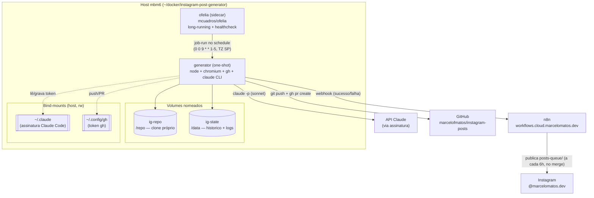
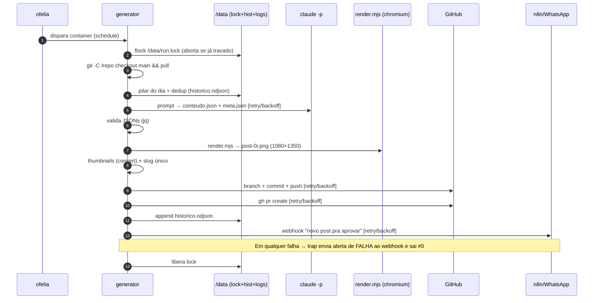

# Spec — Gerador de Posts do Instagram v2 (Docker)

- **Data:** 2026-06-19
- **Autor:** Marcelo Matos (via brainstorming assistido)
- **Status:** aprovada para virar plano de implementação
- **Repo:** `marcelofmatos/instagram-posts`

## 1. Contexto

O **v1** é um scheduler em bash (`.scheduler/`) disparado pelo **cron do host**
(`0 9 * * 1-5`). O `gerar-post.sh` faz todo o pipeline:

1. sincroniza `main` (`git checkout` + `pull`);
2. escolhe o **pilar do dia** e deduplica contra `historico.ndjson`;
3. monta o prompt (`prompt-criar-post.md`) e chama `claude -p --model sonnet`
   para gerar `conteudo.json` + `meta.json`;
4. valida os JSONs com `jq`;
5. renderiza a arte com `node render.mjs` (skill `marcelomatos-instagram-post`,
   que usa **Chromium headless** para rasterizar `template.html` → PNG 1080×1350);
6. gera thumbnails com ImageMagick (`convert`);
7. cria branch, commita as imagens + manifesto em `posts-queue/`, dá push;
8. abre um **Pull Request** no GitHub (`gh pr create`);
9. grava o histórico e avisa no **WhatsApp via webhook do n8n**.

Depois, o n8n publica os posts da `posts-queue/` a cada 6h, quando o PR é mergeado.

### Problema

O v1 viola a regra **Docker-first**: depende do `cron` do usuário e de binários
instalados no host (`claude`, `node`, `jq`, `git`, `gh`, ImageMagick, `iconv`,
Chromium), além da skill em `~/.claude/skills/...`. Não é portável nem autocontido,
e o `git` opera diretamente na working tree do host.

## 2. Objetivo do v2

Containerizar a solução numa stack autocontida (Docker-first) **preservando o
comportamento do pipeline**, com melhorias pontuais de robustez operacional.

Foco escolhido: **containerizar + melhorias pontuais** (não é redesenho de produto).

### 2.1 Objetivos (in scope)

- Rodar **localmente na mbm6**, como stack em `~/docker/instagram-post-generator/`.
- **Eliminar a dependência do host**: cron, CLIs e Chromium passam para dentro da imagem.
- **Agendamento dentro da stack** via sidecar **Ofelia** (sem cron do host).
- **Renderizador vendorizado** no próprio repo (COPY na imagem) — imagem 100% autocontida.
- **Git desacoplado da working tree do host**: o container mantém o **seu próprio clone**.
- Melhorias: **retry/backoff**, **alerta de falha no WhatsApp**, **healthcheck + lock
  anti-duplicata**, **logs + histórico em volume persistente**.

### 2.2 Não-objetivos (out of scope)

- Mudar o formato dos posts, a estratégia de conteúdo ou o prompt.
- Mudar o fluxo de publicação do n8n (continua publicando da `posts-queue/` no merge).
- Mudar o mecanismo de aprovação (continua sendo merge do PR no GitHub).
- Rodar na nuvem (cloud Swarm) — decidido rodar **local**. Pode ser um v3 futuro.

## 3. Decisões de arquitetura (já fechadas no brainstorming)

| Tema | Decisão | Motivo |
|------|---------|--------|
| Escopo | Containerizar + melhorias pontuais | Pedido do usuário |
| Host | Local (mbm6), stack em `~/docker/` | Auth do Claude/gh é local; simplicidade |
| Agendamento | Sidecar **Ofelia** (`job-run`) | Stack autocontida, sem cron do host |
| Renderizador | **Vendorizado** no repo + `COPY` na imagem | Imagem autocontida (Docker-first) |
| Estratégia git | **Clone próprio** em volume (`Opção A`) | Desacopla da working tree do host |

## 4. Arquitetura

### 4.1 Componentes

Dois containers na mesma stack:

- **`generator`** — imagem buildada do `Dockerfile` deste repo. Tarefa **one-shot**
  (sobe, gera um post, sai). Contém todo o toolchain (ver §5).
- **`ofelia`** — sidecar `mcuadros/ofelia`. Container **long-running** que dispara o
  `generator` no schedule. Tem healthcheck.

### 4.2 Diagrama de arquitetura



### 4.3 Diagrama de fluxo (execução de um post)



## 5. Imagem `generator` (Dockerfile, neste repo)

**Base:** `node:20-bookworm-slim` (traz Node para o `render.mjs`).

**Pacotes via apt:** `git`, `jq`, `imagemagick`, `ca-certificates`, `gnupg`,
`chromium` (headless para o render), `fontconfig`, e o **GitHub CLI** (`gh`,
do repo oficial). `iconv` já vem na libc (usado pelo `slugify`).

**CLI do Claude:** instalada via `npm i -g @anthropic-ai/claude-code` na imagem.

**Conteúdo copiado para a imagem:**
- `scheduler/` → `gerar-post.sh`, `lib.sh`, `prompt-criar-post.md` (migrados de `.scheduler/`).
- `renderer/` → **vendorizado** da skill: `render.mjs`, `template.html`, `fonts/`
  (`f00..f12.woff2` + `fonts.css`). `render.mjs` não tem deps npm (só builtins +
  `execFileSync` chamando Chromium e `convert`).

**Usuário:** roda como usuário não-root `app` (uid mapeável), com `HOME=/home/app`
para casar com o mount `~/.claude`.

**Chromium em container:** o `render.mjs` já chama `--headless=new --no-sandbox`,
compatível com container. A imagem garante que `chromium` está no `PATH` (a função
de descoberta do `render.mjs` procura `google-chrome`/`chromium`/`chromium-browser`).

**Entrypoint:** wrapper que executa `scheduler/gerar-post.sh`. Aceita os mesmos
flags do v1 (`--dry`, `--tema "..."`).

### 5.1 `.dockerignore`

Ignora `.git/`, `.scheduler/`, `posts-queue/`, `docs/`, logs e qualquer artefato
local — só o necessário para o build entra no contexto.

## 6. Volumes e mounts

| Caminho no container | Tipo | Conteúdo |
|----------------------|------|----------|
| `/repo` | volume `ig-repo` | Clone próprio de `marcelofmatos/instagram-posts` |
| `/data` | volume `ig-state` | `historico.ndjson`, `logs/`, `run.lock`, `out/` temporário |
| `/home/app/.claude` | bind `~/.claude` (rw) | Assinatura Claude Code (refresh do token grava de volta) |
| `~/.config/gh` mount | bind (rw) | Token do `gh` para push https + `gh pr create` |

**Bootstrap do clone:** na primeira execução, se `/repo/.git` não existir, o
entrypoint clona `REPO_GIT_URL` em `/repo`. Nas seguintes, faz `checkout main` + `pull`.
O caso em que o repositório remoto **ainda não existe** (projeto do zero) está em §6.1.

**Estado fora do git:** `historico.ndjson` e `logs/` vivem em `/data` (não no clone),
para sobreviverem a um re-clone e não dependerem do `.gitignore`.

### 6.1 Bootstrap do zero (greenfield)

O caso default (§6) assume um repositório remoto **já existente**, com `main` e
`posts-queue/`. Para um projeto **do zero**, a arquitetura (containers, volumes,
mounts) é **idêntica** — muda só o passo de bootstrap, que passa a ter 3 estados:

```
/repo/.git existe?  ── não ──> remoto existe?  ── não ──> init + seed + push
                    │                          └─ sim ──> git clone
                    └─ sim ──> checkout main + pull
```

**Estado "init + seed + push"** (remoto inexistente), executado pelo entrypoint:

1. cria o repositório remoto com o token já montado:
   `gh repo create $REPO_SLUG --private` (ou `--public`, conforme o caso);
2. `git init` em `/repo` + identidade git (`GIT_AUTHOR_NAME`/`GIT_AUTHOR_EMAIL`);
3. semeia a estrutura mínima que o pipeline e o n8n esperam:
   `posts-queue/.gitkeep`, `README.md`;
4. commit inicial e `git push -u origin main`;
5. a partir daí, o loop normal (branch + commit + PR) funciona sem mudanças.

> Como esse passo cria um recurso externo (repo no GitHub), ele só roda quando o
> remoto comprovadamente não existe. Um flag opt-in (ex.: `BOOTSTRAP_INIT=1`) pode
> exigir confirmação explícita antes de criar o repositório — a decidir no plano.

**Pré-requisitos externos (não vivem na imagem)** que um projeto do zero precisa
provisionar à parte, além do repo:

- **Workflow do n8n** que publica da `posts-queue/` a cada 6h no merge — o v2 **não**
  cria isso; precisa existir/ser criado separadamente.
- **Webhook do WhatsApp** (`WA_WEBHOOK`) ativo no n8n.
- **Auth do `gh`** (`~/.config/gh`) e da **assinatura Claude** (`~/.claude`) já
  presentes no host (mounts rw).

**O que já acompanha o projeto** (vendorizado na imagem, não precisa provisionar):
`prompt-criar-post.md`, os pilares e funções (`lib.sh`) e o renderizador
(`renderer/`: `render.mjs`, `template.html`, `fonts/`).

## 7. Configuração (`.env` em `~/docker/instagram-post-generator/`)

```dotenv
# Modelo e repositório
MODEL=sonnet
REPO_SLUG=marcelofmatos/instagram-posts
REPO_GIT_URL=https://github.com/marcelofmatos/instagram-posts.git

# Identidade dos commits automáticos (regra global: identidade canônica)
GIT_AUTHOR_NAME=Marcelo Matos
GIT_AUTHOR_EMAIL=contato@marcelomatos.dev

# WhatsApp via n8n
WA_WEBHOOK=https://workflows.cloud.marcelomatos.dev/webhook/wa-enviar-a91x
WA_NUM=5511977974431

# Agendamento (formato Ofelia: 6 campos, com segundos)
SCHEDULE=0 0 9 * * 1-5
TZ=America/Sao_Paulo

# Robustez
RETRY_MAX=3
RETRY_BASE_SECONDS=5
LOG_RETENTION_DAYS=30

# Bootstrap do zero (greenfield) — opt-in; ver §6.1.
# Só com =1 o entrypoint pode criar o repo remoto se ele não existir.
BOOTSTRAP_INIT=0
```

> **Nota sobre identidade git:** a working tree local hoje usa
> `marcelofmatos@gmail.com`. A regra global do usuário define a identidade canônica
> como `Marcelo Matos <contato@marcelomatos.dev>` — adotada como **default** aqui e
> configurável via env. O e-mail da conta Claude **nunca** é usado como autor/committer.

## 8. `docker-compose.yml` (em `~/docker/instagram-post-generator/`)

Esboço (não-final; detalhado no plano):

```yaml
services:
  generator:
    build: <path-do-repo-instagram-posts>
    image: instagram-post-generator:latest
    env_file: .env
    volumes:
      - ig-repo:/repo
      - ig-state:/data
      - ${HOME}/.claude:/home/app/.claude:rw
      - ${HOME}/.config/gh:/home/app/.config/gh:rw
    # one-shot: não reinicia sozinho; quem dispara é o Ofelia
    restart: "no"
    # não sobe no `up`; só roda quando o Ofelia faz job-run
    profiles: ["manual"]

  ofelia:
    image: mcuadros/ofelia:latest
    depends_on: [generator]
    command: daemon --docker
    volumes:
      - /var/run/docker.sock:/var/run/docker.sock:ro
    labels:
      ofelia.job-run.diario.schedule: "${SCHEDULE}"
      ofelia.job-run.diario.container: "instagram-post-generator-generator"
    healthcheck:
      test: ["CMD", "pgrep", "ofelia"]
      interval: 1m
    restart: unless-stopped

volumes:
  ig-repo:
  ig-state:
```

> Detalhe a resolver no plano: usar `job-run` (sobe container novo a partir da
> imagem) vs. `job-exec` (executa num container parado). `job-run` casa melhor com a
> natureza one-shot. O nome/labels exatos do Ofelia entram no plano.

## 9. Melhorias pontuais (especificação)

### 9.1 Retry/backoff em falhas transitórias
- Helper `retry()` em `lib.sh`: até `RETRY_MAX` tentativas, backoff exponencial a
  partir de `RETRY_BASE_SECONDS`.
- Envolve: `claude -p`, `git push`, `gh pr create`, `curl` do webhook.
- **Não** re-tenta erros determinísticos (ex.: JSON inválido vindo do `claude`) —
  esses abortam direto.

### 9.2 Alerta de falha no WhatsApp
- Hoje só o caminho de sucesso avisa. Adicionar `trap` em `ERR`/`abort()` que envia
  ao mesmo webhook uma mensagem de **falha** (slug/etapa/trecho do log) antes de sair ≠0.
- O envio do alerta é **não-fatal** (se o webhook falhar, registra no log e sai mesmo assim).

### 9.3 Healthcheck + lock anti-duplicata
- **Lock:** `flock` em `/data/run.lock` no início do `gerar-post.sh`; se já travado,
  aborta com log claro (evita dois posts se uma execução sobrepor outra).
- **Healthcheck:** no container `ofelia` (long-running). O `generator` é one-shot,
  então seu "sucesso" é o exit code 0 (observado via log/alerta), não um healthcheck.

### 9.4 Logs + histórico em volume
- `historico.ndjson` e `logs/AAAA-MM-DD.log` em `/data` (volume `ig-state`).
- **Rotação simples:** ao iniciar, remove logs com mtime > `LOG_RETENTION_DAYS` dias.

## 10. Layout de arquivos (entregável)

**Neste repo (`instagram-posts`):**
```
Dockerfile
.dockerignore
scheduler/
  gerar-post.sh        # migrado de .scheduler/ (com retry/lock/trap/paths via /data e /repo)
  lib.sh               # + retry()
  prompt-criar-post.md
renderer/              # vendorizado da skill marcelomatos-instagram-post
  render.mjs
  template.html
  fonts/  (f00..f12.woff2, fonts.css)
docs/
  ARQUITETURA.md       # Mermaid: arquitetura + fluxo (regra global de documentação)
  superpowers/specs/2026-06-19-instagram-post-generator-v2-docker-design.md
```

**Em `~/docker/instagram-post-generator/`:**
```
docker-compose.yml
.env
README.md
```

> O `.scheduler/` do v1 fica **deprecado**; a linha do crontab do host é removida
> quando o v2 entra em produção (passo de cutover no plano).

## 11. Verificação / testes

- **Build:** `docker build` da imagem conclui; `chromium`, `gh`, `claude`, `jq`,
  `convert` e `node` respondem `--version` dentro do container.
- **Dry-run:** `docker compose run --rm generator --dry` gera `out/` com os PNGs e o
  manifesto, **sem** criar branch/PR (igual ao `--dry` do v1).
- **Render:** os PNGs saem em 1080×1350.
- **Lock:** duas execuções simultâneas → a segunda aborta pelo `flock`.
- **Retry:** simular falha transitória (ex.: webhook 5xx) → re-tenta e segue.
- **Alerta de falha:** forçar erro (ex.: `REPO_GIT_URL` inválida) → chega mensagem de
  falha no WhatsApp.
- **Agendamento:** Ofelia dispara o `generator` no horário configurado (validar com
  `SCHEDULE` curto num teste).
- **Persistência:** `historico.ndjson` e logs sobrevivem a `docker compose down` (sem `-v`).
- **End-to-end:** uma execução real abre o PR no GitHub e avisa no WhatsApp como no v1.

## 12. Riscos e pontos em aberto (para o plano)

- **Sandbox do Chromium:** rodar `--no-sandbox` como não-root é o caminho usual em
  container; validar que o render funciona sem `--cap-add`/seccomp custom.
- **Mount do socket do Docker no Ofelia** dá ao sidecar controle do daemon — aceitável
  num host pessoal; documentar no README.
- **Refresh do token Claude:** confirmar que o mount `~/.claude` rw permite o
  `claude -p` renovar o OAuth de dentro do container (uid/permissões).
- **`gh` como credential helper:** `gh auth setup-git` precisa rodar no entrypoint
  para o `git push` https autenticar com o token montado.
- **Forma do Ofelia** (`job-run` vs `job-exec`, nomes de label) — decidir no plano.
- **Vendorização vs. divergência da skill:** a cópia em `renderer/` pode divergir da
  skill `marcelomatos-instagram-post`; documentar como ressincronizar (não automatizado neste v2).

## 13. Resumo do que muda do v1 para o v2

| Aspecto | v1 | v2 |
|--------|----|----|
| Disparo | cron do host | sidecar Ofelia (na stack) |
| Toolchain | binários do host | dentro da imagem |
| Renderizador | skill em `~/.claude` | vendorizado + `COPY` |
| Git | working tree do host | clone próprio em volume |
| Estado | `.scheduler/` (host) | volume `ig-state` |
| Falhas | aborta; só sucesso avisa | retry/backoff + alerta de falha |
| Concorrência | sem proteção | `flock` anti-duplicata |
